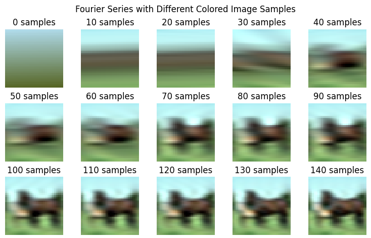

## Fourier Compression

This project demonstrates how **linear regression** combined with **Fourier features** can be used to compress images efficiently. Instead of working directly with pixel values, the data is transformed into a set of **sine and cosine features** based on Fourier series, allowing for effective compression with reduced storage requirements.

## Model

-   A basic **linear regression** model is trained on new Fourier-transformed data.
-   Tested across grayscale and colored images with **CIFAR-10** dataset.
-   Uses Scikit's [LinearRegression](https://scikit-learn.org/stable/modules/generated/sklearn.linear_model.LinearRegression.html) with default settings

## Fourier Features

-   The **sine-cosine form** of Fourier series is used to replace raw pixel values with frequency-based features.
-   Each sample corresponds to a specific frequency of the wave, and a linear regression model learns the **amplitudes** of these frequencies.
-   Fourier series equation (sine-cosine form):

$$
s_{_N}(x) = C_0 + \sum_{n=1}^N \left(
A_n \cos \left(2 \pi \tfrac{n}{P} x \right) +
B_n \sin \left(2 \pi \tfrac{n}{P} x  \right) \right)
$$

## Results

-   **Compression Achieved:** Compression resulted in smaller image sizes than the original data without significant loss of clarity.
-   **Visualization of Clarity:**
    -   Plotted the compressed and original versions to observe how quality improves with increasing Fourier samples.
    -   Beyond a certain threshold, increasing samples no longer improved clarity.

## Sample

## Limitations

-   **Computational Complexity:**
    -   The approach scales with $O(N^2)$, where $N$ is the number of pixels, making it impractical for large images.
    -   FFT (Fast Fourier Transform) offers a faster $O(N log N)$ alternative for large datasets.
-   **Hyperparameter Tuning:** The number of Fourier samples and period were chosen manually without extensive tuning.
-   **Not Suitable for Bigger Images:** Large images would require advanced models like neural networks for better performance.

## Future Ideas

-   **Hyperparameter Tuning:** Experiment with different sample sizes and periods to optimize for accuracy vs. compression ratio.
-   **Use Autoencoders:** Investigate the use of autoencoders for frequency-based feature extraction and compression.

## **Acknowledgments**

-   [**Wikipedia**](https://en.wikipedia.org/wiki/Fourier_series) for the Fourier series equations.
-   [**CIFAR-10 Dataset**](https://www.cs.toronto.edu/%7Ekriz/cifar.html) for sample images used during testing.
